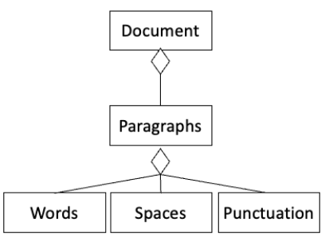

100%

Q1. Functional decomposition is defined as a way to analyse a system by identifying the major tasks or services of an application domain and breaking them down into sub-tasks.

Q2. An accounting system must support monitoring accounts and generating invoices. When generating invoices a user must create an Invoice Header with the Business Information, include the Client's Contact Details, Provide Invoice Information and Specify the Payment Terms.
 - Functional decomposition

Q3. Which VML diagram best represents the hierarchy of this system: A document is made up of paragraphs which consists of words, spaces and punctuation.  

Q4. Which of these best express the relationship between analysis and design artefacts and problem vs solution-oriented thinking.
 - The context specification and requirements specification are in the problem space, the system specification and implementation are in the solution space.

Q5. A stakeholder is a person with an interest in the system under development.

Q6. Ways to identify stakeholders **do not** include analysing the IEEE SRS standard.

Q7. The onion model is used to analyse stakeholders in the system of systems surrounding our product.

Q8. A good goal should be achievable, easy to say when satisfied, be about the system development process or something the system will do with its environment.

